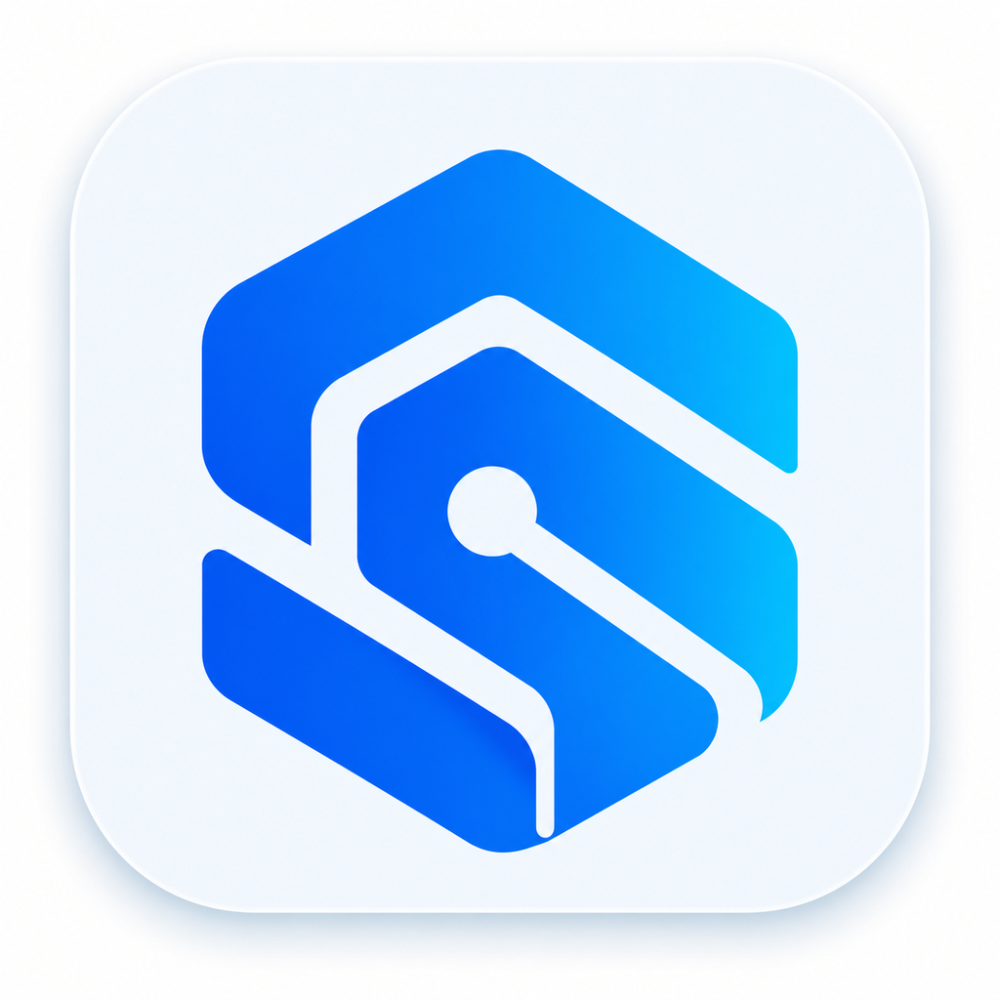
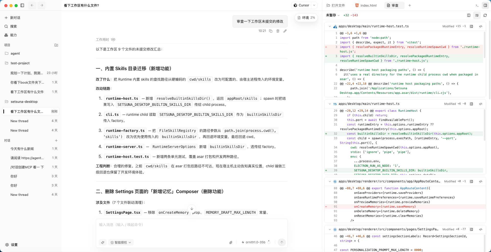
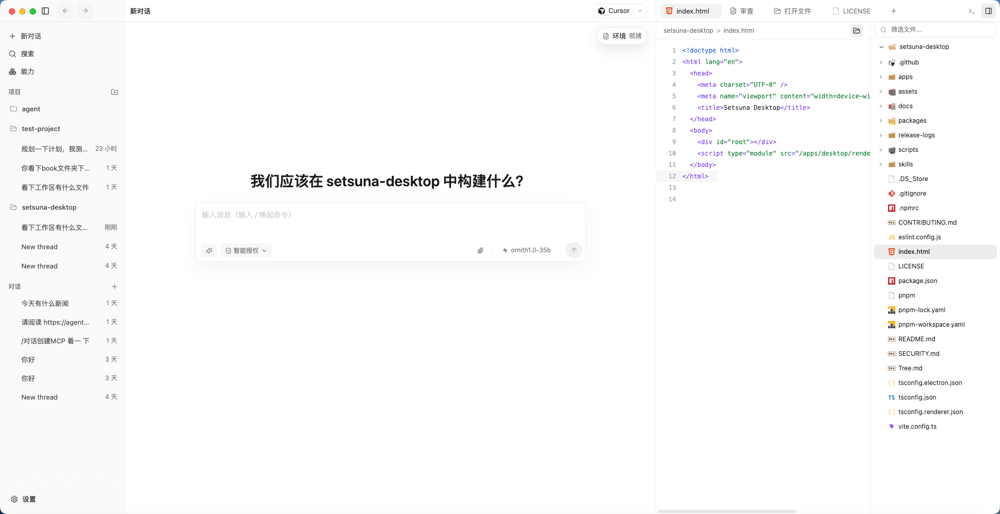
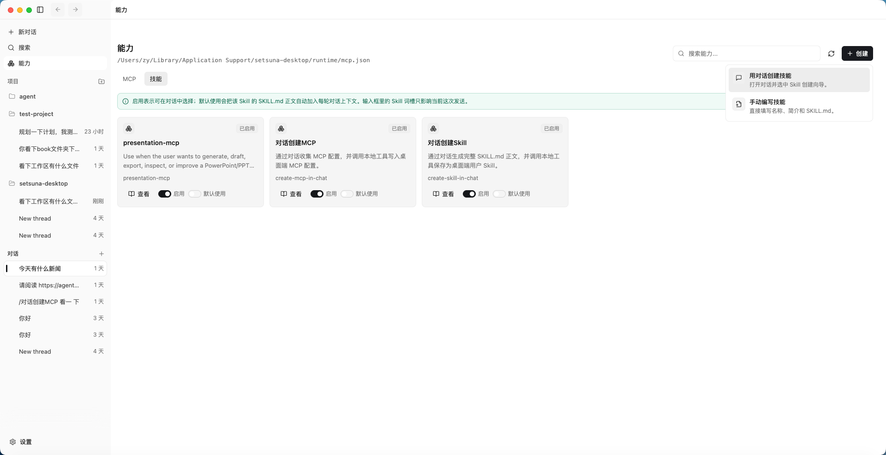
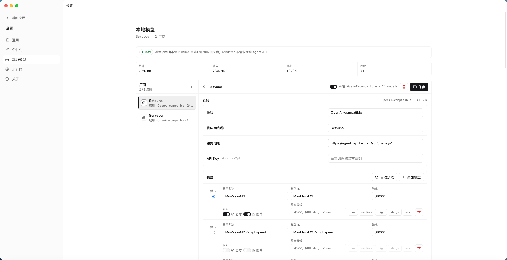
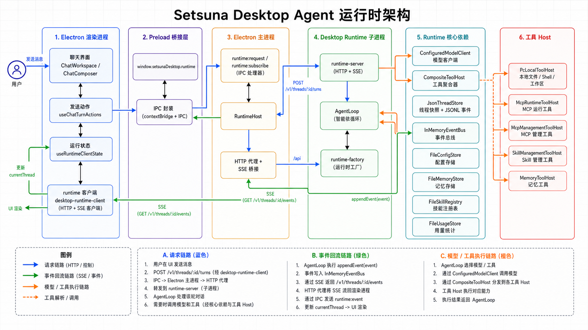

<p align="center">
  
</p>

<h1 align="center">Setsuna Desktop</h1>

<p align="center">
  本地优先的 AI Agent 桌面工作台。把对话、项目、文件审查、MCP、Skills、本地模型配置和运行时状态放在同一个桌面应用里。
</p>

<p align="center">
  <a href="LICENSE"></a>
  
  
  
  
</p>

## 产品界面与关键能力

Setsuna Desktop 把本地对话、项目工作区、文件审查、MCP、Skills 和模型配置收在同一个桌面工作台里。下面的界面图展示当前 `0.1.x` 阶段已经落地的核心体验。

<table>
  <tr>
    <td width="100%">
      
      <br>
      <strong>对话与文件审查</strong>
      <br>
      <sub>对话、工作区审查和代码 diff 在同一窗口内协作。</sub>
    </td>
  </tr>
  <tr>
    <td width="100%">
      
      <br>
      <strong>项目工作区启动任务</strong>
      <br>
      <sub>从项目工作区直接开始新任务，保留侧栏、文件和审查区域。</sub>
    </td>
  </tr>
  <tr>
    <td width="100%">
      
      <br>
      <strong>MCP 与 Skill 能力管理</strong>
      <br>
      <sub>MCP 与 Skill 作为本地能力管理，可启用、默认使用或在对话中创建。</sub>
    </td>
  </tr>
  <tr>
    <td width="100%">
      
      <br>
      <strong>模型服务配置</strong>
      <br>
      <sub>模型服务、模型列表、思考能力和多模态能力统一由桌面端配置。</sub>
    </td>
  </tr>
</table>

## 为什么做 Setsuna Desktop

很多 Agent 工具把桌面端做成远端 Web 应用的壳。Setsuna Desktop 反过来：桌面壳只负责本地窗口、文件系统和系统能力，核心 Agent loop、模型调用、工具执行、会话、记忆、MCP 和 Skills 都由本地 runtime 管理。

这意味着：

- 正常使用不依赖后端 Agent API，也不加载远端 WebView。
- 用户可以配置自己的模型供应商和 API Key。
- 会话、项目、用量、memory、MCP 配置和 Skill 状态优先存放在本地。
- renderer 不直接拼 provider 协议，也不直接执行高风险工具。
- GitHub Releases 是后续安装包、校验和、manifest 和构建日志的发布真源。

当前仓库是 `0.1.x` 阶段的本地桌面 runtime 与工作台实现，API 和 UI 仍在快速迭代中。

## 功能

- 本地桌面工作台：Electron + React renderer，包含项目侧栏、对话区、composer、文件/审查/终端等工作区面板。
- 本地 runtime bridge：renderer 通过 preload bridge 与 Electron main 通信，main 启动本地 Node runtime 服务。
- 本地 HTTP/SSE runtime：runtime 负责线程、配置、项目、Skills、MCP、memory、usage、approvals 和事件流。
- 多模型协议：支持 OpenAI-compatible `/chat/completions`、OpenAI Responses `/responses`、Anthropic `/v1/messages`，并保留无 API Key 时的本地 smoke fallback。
- MCP 与 Skills：内置 Skill 随仓库打包，用户 Skill 和 MCP 配置写入本地 runtime 数据目录，运行时工具可注入到 Agent loop。
- 工作区工具：支持项目注册、目录浏览、文件读取、搜索、shell、审查状态和受审批保护的文件写入。
- 本地 memory 与 usage：runtime 记录使用量、维护本地记忆，并可在后续对话中召回。
- 发布骨架：GitHub Actions 提供 CI 与手动 Release workflow，打包产物以 GitHub Release 为 canonical source。

## 快速开始

### 环境要求

- Node.js `>=22.13.0`（线程主存储使用无需启动参数的内置 `node:sqlite`）
- pnpm `7+`

### 本地运行

```bash
git clone https://github.com/Setsuna-Agent/setsuna-desktop.git
cd setsuna-desktop
pnpm install
pnpm dev
```

`pnpm dev` 会同时启动 Vite renderer 和 Electron desktop shell。开发环境默认 renderer 地址是 `http://127.0.0.1:5174`。

如果还没有配置模型供应商，应用会使用本地 smoke fallback 验证 runtime 链路。要连接真实模型，进入 `设置 -> 模型服务` 添加 OpenAI-compatible、OpenAI Responses 或 Anthropic provider。

## 常用脚本

| 命令 | 说明 |
| --- | --- |
| `pnpm dev` | 启动 renderer 与 Electron 开发环境。 |
| `pnpm typecheck` | 运行 TypeScript project references 类型检查。 |
| `pnpm test` | 运行 Vitest 单元测试。 |
| `pnpm lint` | 运行 ESLint。 |
| `pnpm build` | 构建 contracts、runtime、Electron main 和 renderer。 |
| `pnpm package` | 构建并生成本地 unpacked desktop app。 |
| `pnpm package:mac:arm64` | 构建 macOS Apple Silicon 包。 |
| `pnpm package:mac:x64` | 构建 macOS Intel 包。 |
| `pnpm package:win:x64` | 构建 Windows x64 包。 |
| `pnpm package:linux:x64` | 构建 Linux x64 包。 |
| `pnpm release:dry-run` | 本地生成 release manifest 预览和校验信息。 |

## 架构

<p align="center">
  
</p>

这张图展示了 renderer、preload、Electron main、本地 runtime、模型客户端和工具 Host 之间的运行时边界。应用层只负责桌面交互和状态渲染，Agent loop、模型调用、工具执行、事件流和本地存储都收敛在 runtime 内。

```text
React renderer
  -> preload bridge
  -> Electron RuntimeHost
  -> local Node runtime service
  -> ports / adapters / loop / server modules
```

核心边界：

- `apps/desktop`：Electron main、preload、React renderer 和桌面 UI。
- `packages/contracts`：renderer、main 和 runtime 共享的 DTO、事件、线程、配置、workspace、MCP、Skill、memory、usage 类型。
- `packages/desktop-runtime`：本地 runtime service、Agent loop、model adapters、tool hosts、本地存储和 HTTP/SSE API。
- `skills`：随桌面应用打包的内置 Skill。
- `assets`：应用图标、品牌资源和 README 展示资源。
- `docs/local-desktop-runtime-architecture-review.md`：当前本地优先架构的设计背景和阶段目标。

renderer 不直接知道 provider 协议，也不直接构造 runtime URL。模型调用、工具执行、审批、存储和事件流都在 runtime 边界内完成。

## 本地数据

桌面端会把 runtime 数据写入 Electron `userData` 目录下的 `runtime` 子目录。典型内容包括：

- `config`：本地模型供应商、默认模型、外观与偏好配置。
- `threads`：本地对话和运行时事件投影。
- `projects`：用户添加的工作区项目。
- `mcp.json`：本地 MCP server 配置。
- `skills`：用户创建或编辑的 Skill。
- `memory`：本地长期记忆。
- `usage`：本地模型调用和 token 使用记录。

## 模型供应商

Setsuna Desktop 的目标是把模型配置留给用户，而不是绑定单个云端服务。当前 runtime 支持三类 provider：

| Provider | Endpoint |
| --- | --- |
| OpenAI-compatible | `/chat/completions` |
| OpenAI Responses | `/responses` |
| Anthropic | `/v1/messages` |

在设置页中可以配置 base URL、API Key、模型 ID、上下文输出长度、思考等级和图片能力。API Key 留空时不会覆盖已保存密钥。

## 发布策略

GitHub Releases 是 installable artifacts 和 metadata 的唯一真源。正式发布会上传：

- macOS Apple Silicon / Intel：`.dmg` 和 `.zip`。
- Windows x64：NSIS `.exe` 和 `.zip`。
- Ubuntu x64：`.AppImage`、`.deb` 和 `.tar.gz`。
- 共享 metadata：`SHA256SUMS`、`release-manifest.json`、构建日志包。

macOS v1 当前按未签名、未公证、手动安装处理：manifest 会显式标注 `signing: "unsigned"`、`notarization: "skipped"` 和 `installMode: "manual"`。

## 参与开发

贡献前建议先跑：

```bash
pnpm typecheck
pnpm test
pnpm lint
pnpm build
```

更多约定见 [CONTRIBUTING.md](CONTRIBUTING.md)。安全问题见 [SECURITY.md](SECURITY.md)。

## License

[MIT](LICENSE)
