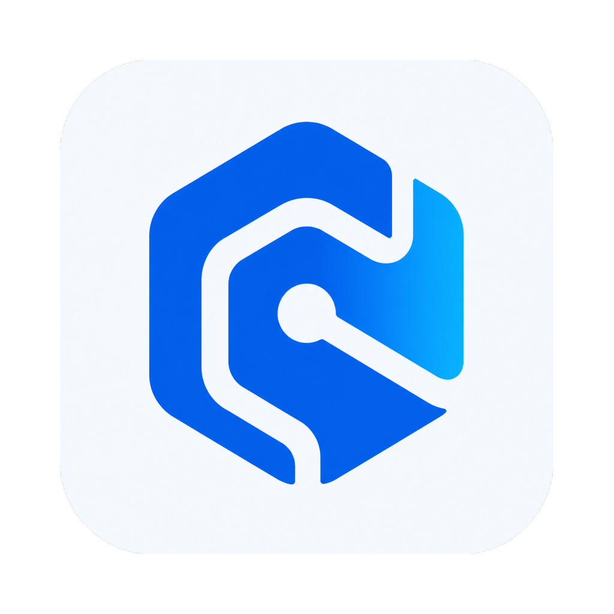
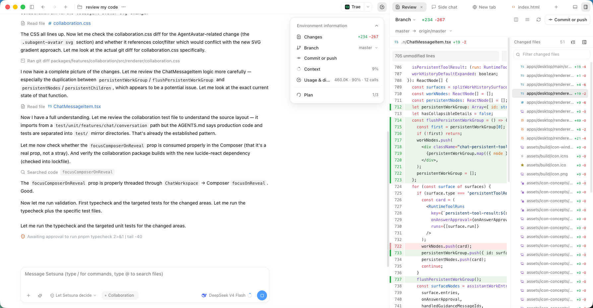
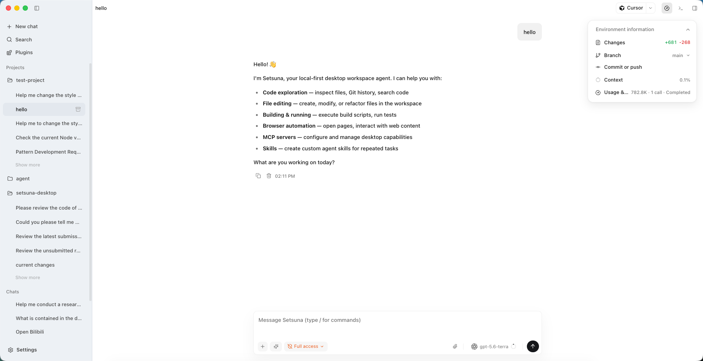
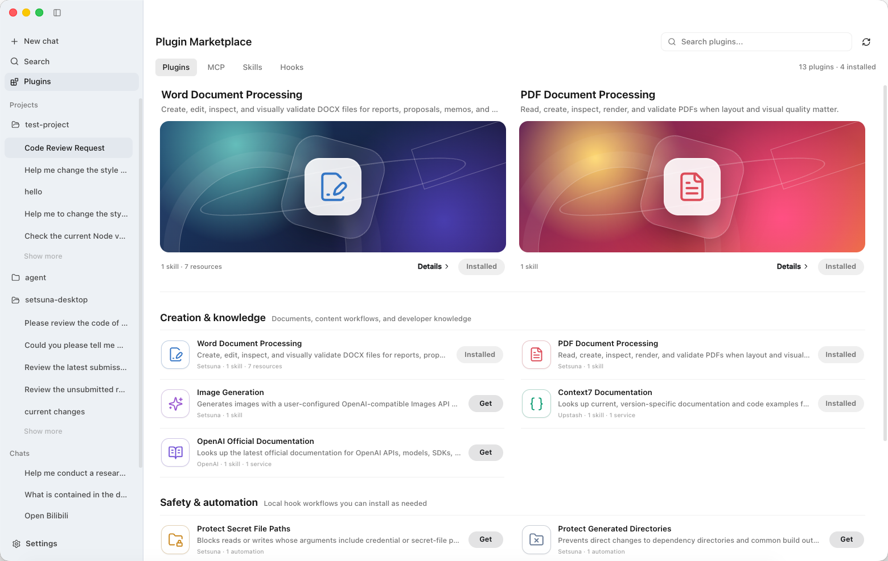
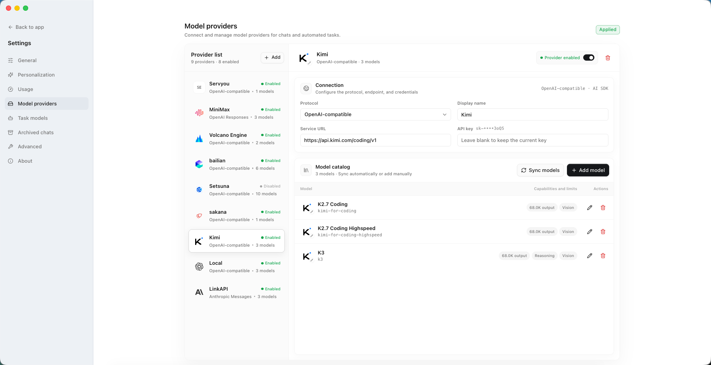
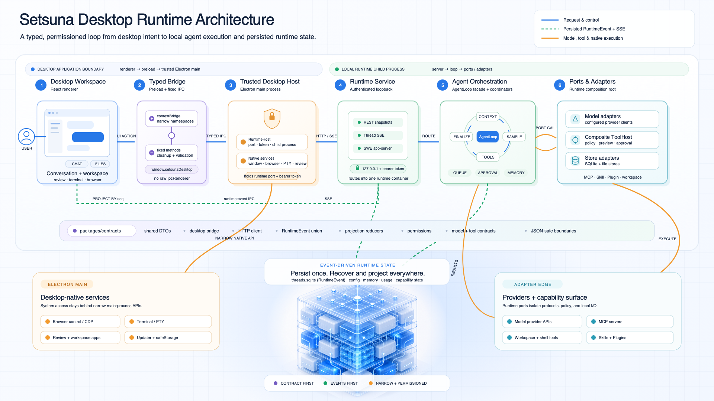
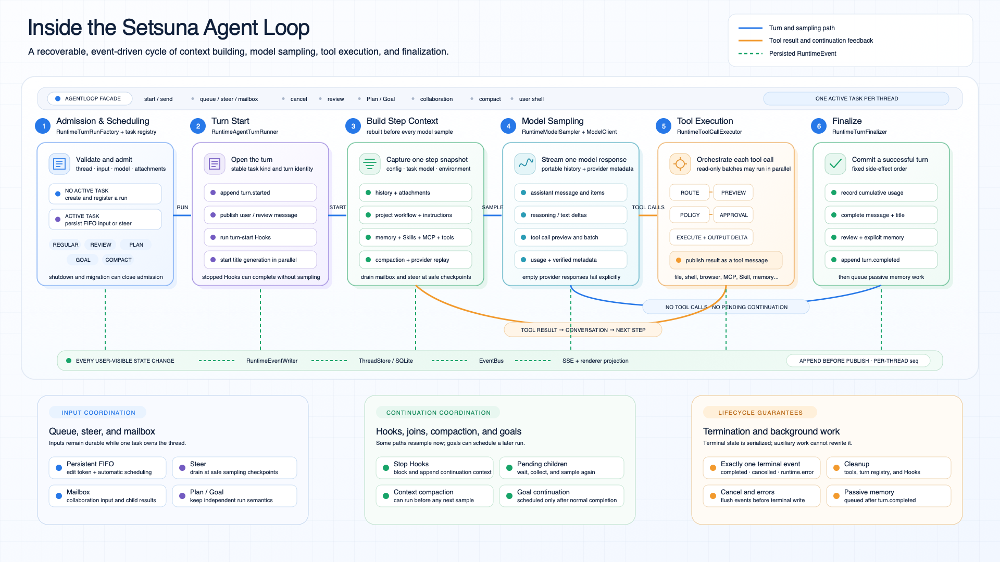

<p align="center">
  
</p>

<h1 align="center">Setsuna Desktop</h1>

<p align="center">
  <strong>Understand, edit, run, and review code with an AI agent.</strong>
</p>

<p align="center">
  An open-source AI agent workspace for macOS, Windows, and Linux.
</p>

<p align="center">
  English · <a href="README.zh-CN.md">简体中文</a>
</p>

<p align="center">
  <a href="https://github.com/Setsuna-Agent/setsuna-desktop/releases/latest">Download</a>
  · <a href="docs/README.md">Documentation</a>
  · <a href="CONTRIBUTING.md">Contributing</a>
  · <a href="https://github.com/Setsuna-Agent/setsuna-desktop/issues">Feedback</a>
</p>

<p align="center">
  <a href="https://github.com/Setsuna-Agent/setsuna-desktop/releases/latest"></a>
  <a href="LICENSE"></a>
  
  
</p>

<p align="center">
  
</p>

Setsuna Desktop combines an AI coding agent with project files, search, diff review, terminals, a built-in browser, model configuration, and extensible capabilities. Start from a repository, ask the agent to investigate or implement a change, follow its tool activity, and review the result without leaving the workspace.

## What you can do

- **Start with the whole project** — give the agent access to project instructions, files, content search, and the active workspace instead of pasting context by hand.
- **Edit, run, and review in one flow** — let the agent read and modify files, run shell commands, inspect diffs, stage or unstage changes, and continue in the integrated terminal.
- **Work with the web when a task needs it** — open sites in the built-in browser and use approval-aware tools for navigation, page inspection, clicks, typing, and waits.
- **Choose the right model per task** — configure OpenAI-compatible Chat Completions, OpenAI Responses, or Anthropic Messages providers, including reasoning and image-capable models.
- **Handle longer workflows** — queue follow-up messages, steer an active turn, switch between Plan and Goal modes, and reuse saved memory when useful.
- **Extend the agent without rebuilding the app** — connect MCP servers, install Skills and Plugins, configure Hooks, and manage them from one capability center.
- **Stay in control** — inspect tool previews, approve sensitive file, shell, browser, and network actions, then review usage and optional debug traces.

## Product tour

<table>
  <tr>
    <td width="50%">
      
      <br>
      <strong>An agent workspace for real projects</strong>
      <br>
      <sub>Start with project navigation, files, review, and workspace context ready, then keep tool activity and results in the same conversation.</sub>
    </td>
    <td width="50%">
      
      <br>
      <strong>Extensible capabilities</strong>
      <br>
      <sub>Discover, install, configure, and control MCP servers, Skills, Plugins, and Hooks from one capability center.</sub>
    </td>
  </tr>
  <tr>
    <td colspan="2">
      
      <br>
      <strong>Provider and model choice</strong>
      <br>
      <sub>Configure endpoints, credentials, models, reasoning levels, context limits, and multimodal support.</sub>
    </td>
  </tr>
</table>

## Download

Get the latest stable build from [GitHub Releases](https://github.com/Setsuna-Agent/setsuna-desktop/releases/latest).

| Platform | Release artifacts |
| --- | --- |
| macOS Apple Silicon | DMG, ZIP |
| macOS Intel | DMG, ZIP |
| Windows x64 | NSIS installer, ZIP |
| Linux x64 | AppImage, DEB, tar.gz |

Each release also includes `SHA256SUMS` and `release-manifest.json` for checksum and artifact metadata verification.

> [!IMPORTANT]
> macOS builds are currently unsigned and not notarized, so installation is manual. Check the release notes before installing.

> [!WARNING]
> Setsuna Desktop is under active development on the path to 1.0. Features, interfaces, and local data formats may change between releases.

## How it works

<p align="center">
  
</p>

The renderer never connects directly to the runtime port, provider credentials, or the local file system. Electron main owns native capabilities and the runtime token, while the runtime owns agent behavior, tool execution, events, and persistence.

### Inside the Agent loop

<p align="center">
  
</p>

Each turn is admitted and serialized per thread. Before every model sample, the runtime rebuilds the current environment, history, memory, Skills, MCP, and tool surface. Tool results flow back into the next sampling step, while completion, cancellation, Hooks, queues, collaboration, usage, titles, and memory converge on the same persisted event spine.

| Module | Responsibility |
| --- | --- |
| [`apps/desktop`](apps/desktop) | Electron main, preload bridge, React renderer, and desktop-native capabilities |
| [`packages/contracts`](packages/contracts) | Shared DTOs, events, projections, and client contracts |
| [`packages/desktop-runtime`](packages/desktop-runtime) | HTTP/SSE service, agent loop, ports/adapters, tools, and local stores |
| [`plugins`](plugins) | Curated capability bundles distributed with the application |
| [`skills`](skills) | Built-in Skills available without a separate Plugin installation |
| [`docs`](docs/README.md) | Module-oriented architecture, runtime flows, extension points, and validation guides |

Three boundaries shape the implementation:

1. **Contract first** — cross-process data structures live in `packages/contracts`.
2. **Event driven** — append-only runtime events are the source of truth; snapshots are projections.
3. **Narrow and permissioned** — native access stays behind preload APIs, workspace paths are constrained, and sensitive tools are policy-controlled.

For a guided codebase tour, start with the [documentation index](docs/README.md) and use [Tree.md](Tree.md) when you need a file-level map.

## Run from source

### Requirements

- Node.js `>=22.13.0`
- pnpm `7.33.7`

### Development

```bash
git clone https://github.com/Setsuna-Agent/setsuna-desktop.git
cd setsuna-desktop
corepack enable
pnpm install
pnpm dev
```

`pnpm dev` starts both the Vite renderer and the Electron desktop shell. If no model provider is configured, the local smoke fallback can be used to verify the runtime path; add a provider under **Settings → Model providers** to use a real model.

## Model APIs

| Provider type | API endpoint |
| --- | --- |
| OpenAI-compatible Chat Completions | `/chat/completions` |
| OpenAI Responses | `/responses` |
| Anthropic Messages | `/v1/messages` |

Provider endpoints, API keys, model IDs, reasoning levels, output limits, and image support are managed from the desktop settings. Saved secrets are not exposed to renderer state.

## Development commands

| Command | Purpose |
| --- | --- |
| `pnpm dev` | Start the renderer and Electron development environment |
| `pnpm typecheck` | Run architecture checks and TypeScript project-reference checks |
| `pnpm test` | Run unit and integration tests |
| `pnpm lint` | Run ESLint with zero warnings allowed |
| `pnpm build` | Build contracts, runtime, Electron, and renderer packages |

See [Development](docs/development/README.md), [Testing](docs/development/testing.md), and [Build and release](docs/development/build-and-release.md) for the full workflow.

## Contributing and security

Contributions are welcome. Read [CONTRIBUTING.md](CONTRIBUTING.md) before opening a pull request, use [GitHub Issues](https://github.com/Setsuna-Agent/setsuna-desktop/issues) for bugs and feature requests, and follow [SECURITY.md](SECURITY.md) when reporting a vulnerability.

Setsuna Desktop is part of the [Setsuna Agent](https://github.com/Setsuna-Agent) open-source organization.

## License

[MIT](LICENSE)
