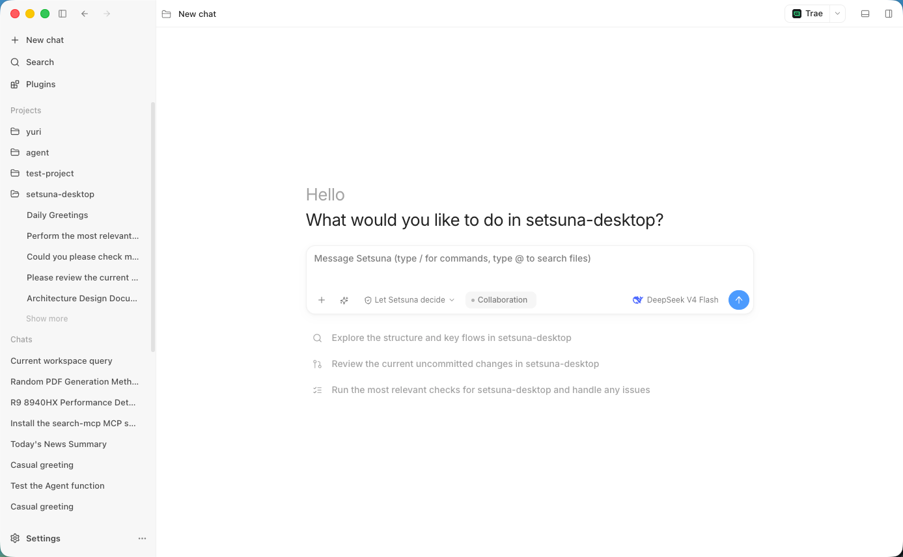

<p align="center">
  
</p>

<h1 align="center">Setsuna Desktop</h1>

<p align="center">
  <strong>让 AI 理解、修改、运行并审查你的代码。</strong>
</p>

<p align="center">
  面向 macOS、Windows 和 Linux 的开源 AI Agent 工作台。
</p>

<p align="center">
  <a href="README.md">English</a> · 简体中文
</p>

<p align="center">
  <a href="https://github.com/Setsuna-Agent/setsuna-desktop/releases/latest">下载</a>
  · <a href="docs/README.md">文档</a>
  · <a href="CONTRIBUTING.md">参与贡献</a>
  · <a href="https://github.com/Setsuna-Agent/setsuna-desktop/issues">问题反馈</a>
</p>

<p align="center">
  <a href="https://github.com/Setsuna-Agent/setsuna-desktop/releases/latest"></a>
  <a href="LICENSE"></a>
  
  
</p>

<p align="center">
  
</p>

## 产品界面

<p align="center">
  
</p>

## 下载

从 [GitHub Releases](https://github.com/Setsuna-Agent/setsuna-desktop/releases/latest) 获取最新稳定版本。

| 平台 | 发布产物 |
| --- | --- |
| macOS Apple Silicon | DMG、ZIP |
| macOS Intel | DMG、ZIP |
| Windows x64 | NSIS 安装程序、ZIP |
| Linux x64 | AppImage、DEB、tar.gz |

每次发布还会提供 `SHA256SUMS` 与 `release-manifest.json`，用于校验文件完整性和查看产物元数据。

> [!IMPORTANT]
> 当前 macOS 构建尚未签名和公证，需要手动安装。安装前请先查看对应版本的 release notes。

> [!WARNING]
> Setsuna Desktop 正处于迈向 1.0 的活跃开发阶段。不同版本之间的功能、接口和本地数据格式仍可能发生变化。

## 从源码运行

### 开发环境

```bash
git clone https://github.com/Setsuna-Agent/setsuna-desktop.git
cd setsuna-desktop
corepack enable
pnpm install
pnpm dev
```

`pnpm dev` 会同时启动 Vite renderer 和 Electron desktop shell。如果还没有配置模型供应商，可以使用本地 smoke fallback 验证 runtime 链路；要连接真实模型，请前往**设置 → 模型服务**添加供应商。

## 开发命令

| 命令 | 用途 |
| --- | --- |
| `pnpm dev` | 启动 renderer 与 Electron 开发环境 |
| `pnpm typecheck` | 运行架构检查与 TypeScript project references 检查 |
| `pnpm test` | 运行单元测试和集成测试 |
| `pnpm lint` | 运行 ESLint，并且不允许 warning |
| `pnpm build` | 构建 contracts、runtime、Electron 与 renderer |

完整流程见[开发入口](docs/development/README.md)、[测试与验证](docs/development/testing.md)和[构建与发布](docs/development/build-and-release.md)。

## 参与贡献与安全反馈

欢迎参与贡献。提交 Pull Request 前请先阅读 [CONTRIBUTING.md](CONTRIBUTING.md)；bug 与功能建议可以提交到 [GitHub Issues](https://github.com/Setsuna-Agent/setsuna-desktop/issues)；报告安全漏洞时请遵循 [SECURITY.md](SECURITY.md)。

Setsuna Desktop 是 [Setsuna Agent](https://github.com/Setsuna-Agent) 开源组织的一部分。

## 许可证

[MIT](LICENSE)
