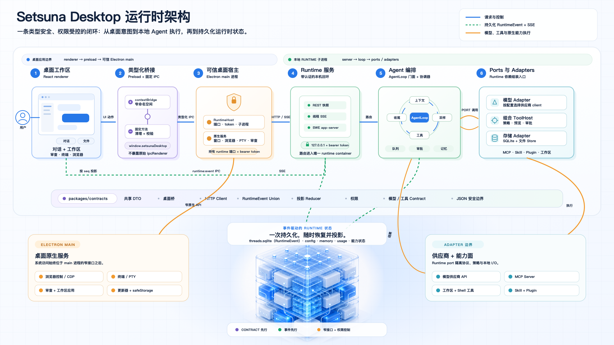
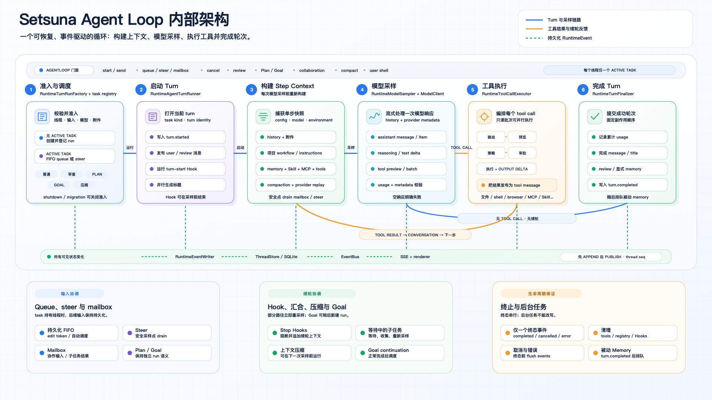

<p align="center">
  
</p>

<h1 align="center">Setsuna Desktop</h1>

<p align="center">
  <strong>让 AI 理解、修改、运行并审查你的代码。</strong>
</p>

<p align="center">
  面向 macOS、Windows 和 Linux 的开源 AI Agent 工作台。
</p>

<p align="center">
  <a href="README.md">English</a> · 简体中文
</p>

<p align="center">
  <a href="https://github.com/Setsuna-Agent/setsuna-desktop/releases/latest">下载</a>
  · <a href="docs/README.md">文档</a>
  · <a href="CONTRIBUTING.md">参与贡献</a>
  · <a href="https://github.com/Setsuna-Agent/setsuna-desktop/issues">问题反馈</a>
</p>

<p align="center">
  <a href="https://github.com/Setsuna-Agent/setsuna-desktop/releases/latest"></a>
  <a href="LICENSE"></a>
  
  
</p>

<p align="center">
  
</p>

Setsuna Desktop 把 AI 编程 Agent、项目文件、搜索、diff 审查、终端、内置浏览器、模型配置和扩展能力整合在同一个桌面工作台里。你可以从仓库直接发起任务，让 Agent 调查问题或实现改动，实时查看工具执行过程，并在同一界面审查结果。

## 你可以做什么

- **从完整项目上下文开始**：让 Agent 读取项目说明、文件、内容搜索结果和当前工作区，无需反复手动粘贴上下文。
- **编辑、运行、审查一条链路完成**：让 Agent 读写文件、执行 shell 命令，再检查 diff、stage 或 unstage 改动，也可以直接在集成终端中继续处理。
- **任务需要时直接使用 Web**：在内置浏览器中打开页面，并通过带审批的工具完成导航、页面检查、点击、输入和等待。
- **为不同任务选择合适模型**：配置 OpenAI-compatible Chat Completions、OpenAI Responses 或 Anthropic Messages 服务，并选择支持推理与图片输入的模型。
- **处理更长的工作流**：为进行中的任务排队后续消息、立即 steer 当前 turn、切换 Plan 或 Goal 模式，并在需要时复用已保存的 memory。
- **无需改代码即可扩展 Agent**：连接 MCP Server、安装 Skill 与 Plugin、配置 Hook，并在能力中心统一管理。
- **全过程可见、可控**：执行前检查工具预览，审批敏感的文件、shell、浏览器和网络操作，随后查看 usage 与可选 debug trace。

## 产品界面

<table>
  <tr>
    <td width="50%">
      
      <br>
      <strong>面向真实项目的 Agent 工作区</strong>
      <br>
      <sub>带着项目导航、文件、审查和工作区上下文直接开始任务，让工具执行与结果始终留在同一条对话中。</sub>
    </td>
    <td width="50%">
      
      <br>
      <strong>灵活扩展 Agent 能力</strong>
      <br>
      <sub>在能力中心发现、安装、配置并控制 MCP Server、Skill、Plugin 与 Hook。</sub>
    </td>
  </tr>
  <tr>
    <td colspan="2">
      
      <br>
      <strong>自主选择供应商与模型</strong>
      <br>
      <sub>统一配置服务地址、凭据、模型、思考等级、上下文限制和多模态能力。</sub>
    </td>
  </tr>
</table>

## 下载

从 [GitHub Releases](https://github.com/Setsuna-Agent/setsuna-desktop/releases/latest) 获取最新稳定版本。

| 平台 | 发布产物 |
| --- | --- |
| macOS Apple Silicon | DMG、ZIP |
| macOS Intel | DMG、ZIP |
| Windows x64 | NSIS 安装程序、ZIP |
| Linux x64 | AppImage、DEB、tar.gz |

每次发布还会提供 `SHA256SUMS` 与 `release-manifest.json`，用于校验文件完整性和查看产物元数据。

> [!IMPORTANT]
> 当前 macOS 构建尚未签名和公证，需要手动安装。安装前请先查看对应版本的 release notes。

> [!WARNING]
> Setsuna Desktop 正处于迈向 1.0 的活跃开发阶段。不同版本之间的功能、接口和本地数据格式仍可能发生变化。

## 工作原理

<p align="center">
  
</p>

renderer 不会直接连接 runtime 端口、读取模型凭据或访问本地文件系统。Electron main 持有系统能力和 runtime token；runtime 负责 Agent 行为、工具执行、事件与持久化。

### Agent Loop 内部架构

<p align="center">
  
</p>

每个 turn 都按线程串行准入；每次模型采样前，runtime 都会重新构建环境、历史、memory、Skill、MCP 与工具面。工具结果会回到下一次 sampling，而完成、取消、Hook、队列、协作、usage、标题和 memory 则统一收敛到同一条持久化事件链路。

| 模块 | 职责 |
| --- | --- |
| [`apps/desktop`](apps/desktop) | Electron main、preload bridge、React renderer 与桌面原生能力 |
| [`packages/contracts`](packages/contracts) | 共享 DTO、事件、投影与 client contract |
| [`packages/desktop-runtime`](packages/desktop-runtime) | HTTP/SSE service、Agent loop、ports/adapters、工具与本地 store |
| [`plugins`](plugins) | 随应用分发的精选能力 Bundle |
| [`skills`](skills) | 无需单独安装 Plugin 即可使用的内置 Skill |
| [`docs`](docs/README.md) | 按模块组织的架构、运行链路、扩展点与验证指南 |

项目实现遵循三个核心边界：

1. **Contract 先行**：跨进程数据结构统一放在 `packages/contracts`。
2. **事件驱动**：append-only runtime event 是真源，snapshot 是投影结果。
3. **窄接口与权限控制**：系统能力收口在 preload API 后，工作区路径受到限制，敏感工具由策略控制。

第一次探索代码库时，建议从[文档索引](docs/README.md)开始；需要定位具体文件时再查 [Tree.md](Tree.md)。

## 从源码运行

### 环境要求

- Node.js `>=22.13.0`
- pnpm `7.33.7`

### 开发环境

```bash
git clone https://github.com/Setsuna-Agent/setsuna-desktop.git
cd setsuna-desktop
corepack enable
pnpm install
pnpm dev
```

`pnpm dev` 会同时启动 Vite renderer 和 Electron desktop shell。如果还没有配置模型供应商，可以使用本地 smoke fallback 验证 runtime 链路；要连接真实模型，请前往**设置 → 模型服务**添加供应商。

## 模型 API

| 供应商类型 | API Endpoint |
| --- | --- |
| OpenAI-compatible Chat Completions | `/chat/completions` |
| OpenAI Responses | `/responses` |
| Anthropic Messages | `/v1/messages` |

服务地址、API Key、模型 ID、思考等级、输出限制和图片能力都由桌面设置管理，已保存的密钥不会暴露给 renderer 状态。

## 开发命令

| 命令 | 用途 |
| --- | --- |
| `pnpm dev` | 启动 renderer 与 Electron 开发环境 |
| `pnpm typecheck` | 运行架构检查与 TypeScript project references 检查 |
| `pnpm test` | 运行单元测试和集成测试 |
| `pnpm lint` | 运行 ESLint，并且不允许 warning |
| `pnpm build` | 构建 contracts、runtime、Electron 与 renderer |

完整流程见[开发入口](docs/development/README.md)、[测试与验证](docs/development/testing.md)和[构建与发布](docs/development/build-and-release.md)。

## 参与贡献与安全反馈

欢迎参与贡献。提交 Pull Request 前请先阅读 [CONTRIBUTING.md](CONTRIBUTING.md)；bug 与功能建议可以提交到 [GitHub Issues](https://github.com/Setsuna-Agent/setsuna-desktop/issues)；报告安全漏洞时请遵循 [SECURITY.md](SECURITY.md)。

Setsuna Desktop 是 [Setsuna Agent](https://github.com/Setsuna-Agent) 开源组织的一部分。

## 许可证

[MIT](LICENSE)
