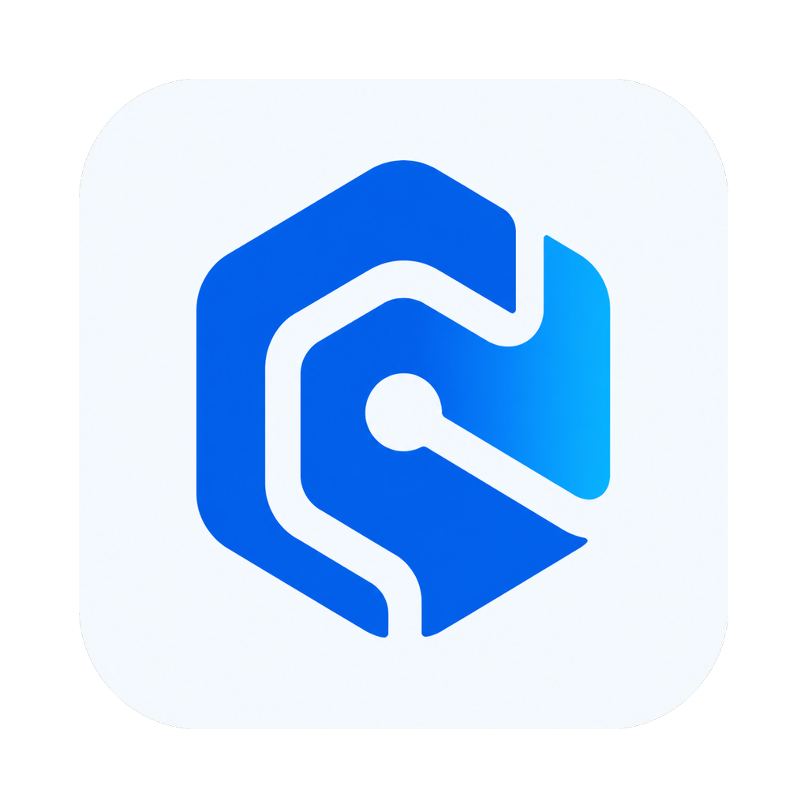
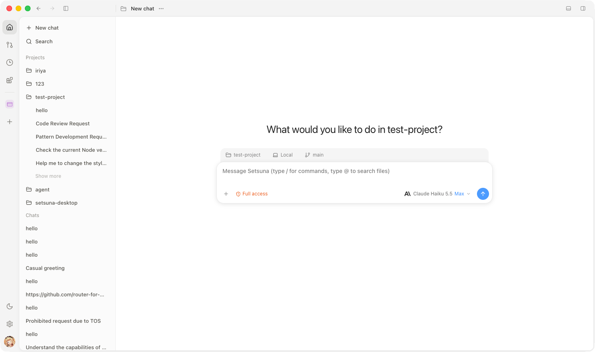
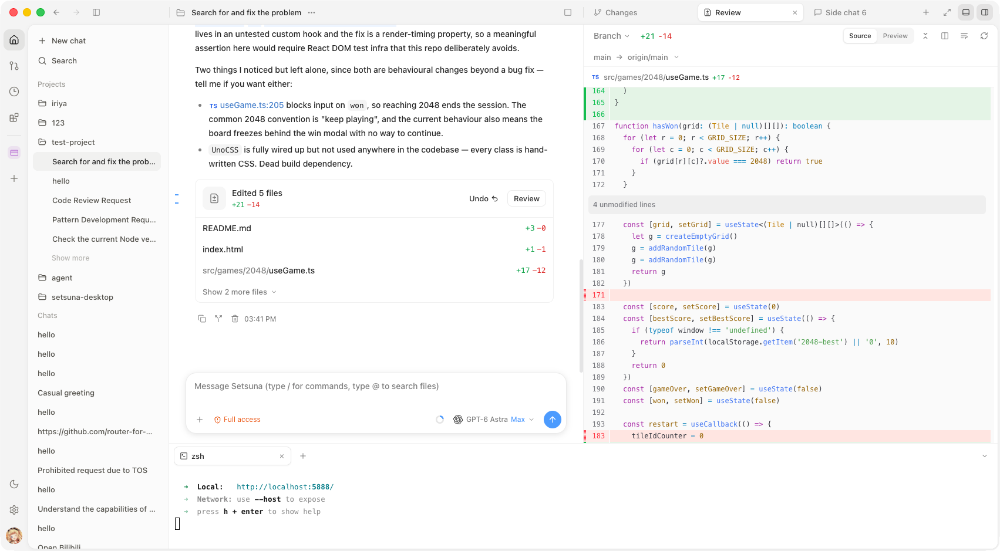
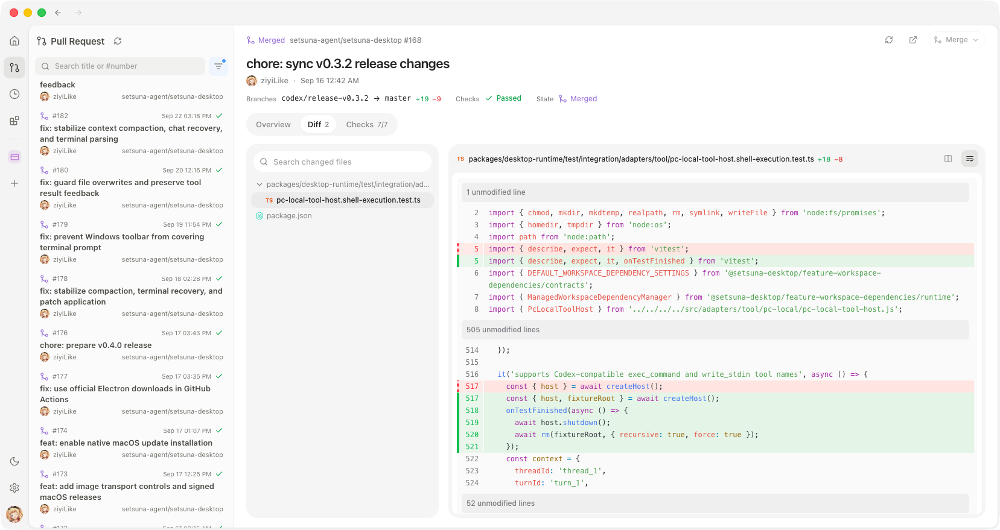
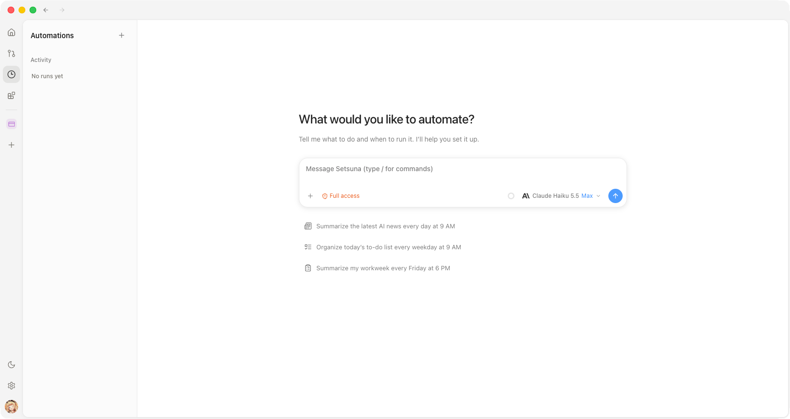
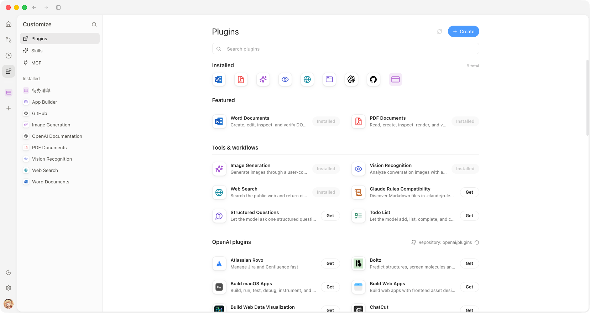
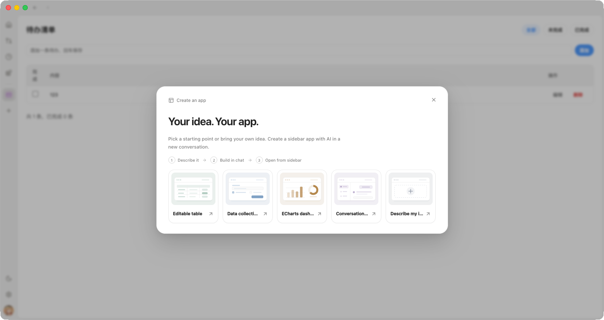

<p align="center">
  
</p>

<h1 align="center">Setsuna Desktop</h1>

<p align="center">
  开源的桌面 AI 编程助手，支持 macOS 和 Windows。
</p>

<p align="center">
  <a href="README.md">English</a> · 简体中文
</p>

<p align="center">
  <a href="https://github.com/Setsuna-Agent/setsuna-desktop/releases/latest">下载</a>
  · <a href="docs/README.md">文档</a>
  · <a href="CONTRIBUTING.md">参与贡献</a>
  · <a href="https://github.com/Setsuna-Agent/setsuna-desktop/issues">问题反馈</a>
</p>

<p align="center">
  <a href="https://github.com/Setsuna-Agent/setsuna-desktop/releases/latest"></a>
  <a href="LICENSE"></a>
  
</p>

<p align="center">
  <a href="assets/readme/setsuna-home.png"></a>
</p>

## 产品界面

### 编程工作区

<p align="center">
  <a href="assets/readme/chat-review.png"></a>
</p>

### Pull Request

<p align="center">
  <a href="assets/readme/pull-requests.png"></a>
</p>

### 自动化

<p align="center">
  <a href="assets/readme/automations.png"></a>
</p>

### 插件

<p align="center">
  <a href="assets/readme/plugins.png"></a>
</p>

### 应用构建

<p align="center">
  <a href="assets/readme/app-builder.png"></a>
</p>

## 下载

在 [GitHub Releases](https://github.com/Setsuna-Agent/setsuna-desktop/releases/latest) 下载最新版本。

| 平台 | 安装包 |
| --- | --- |
| macOS Apple Silicon | DMG |
| macOS Intel | DMG |
| Windows x64 | EXE |

从 **v0.4.0** 起，macOS 版已完成开发者签名和 Apple 公证。下载并打开 DMG，将 Setsuna Desktop 拖入「应用程序」即可安装。

如果你在 Mac 上使用的是 v0.3.x 或更早版本，请先退出应用，再用新版 DMG 安装一次。之后就可以在应用内下载更新，点击「重启安装」完成升级。

打开应用后，在**设置 → 模型服务**中添加你的模型供应商。

## 从源码运行

需要 Git、Node.js `>=22.19.0` 和 pnpm `7.33.7`。macOS 开发需要 macOS 14+ 和 Xcode Command Line Tools，用于编译桌面控制助手，见 [macOS 开发环境](docs/development/README.md#macos)。Windows 还需要 Rust 和 C++ 构建工具，见 [Windows 开发环境](docs/development/README.md#windows-x64)。

```bash
git clone https://github.com/Setsuna-Agent/setsuna-desktop.git
cd setsuna-desktop
corepack enable
pnpm install
pnpm dev
```

测试、构建和常见问题见[开发文档](docs/development/README.md)。

## 参与贡献

Bug 和功能建议可以提到 [Issues](https://github.com/Setsuna-Agent/setsuna-desktop/issues)。代码贡献见 [CONTRIBUTING.md](CONTRIBUTING.md)，安全问题见 [SECURITY.md](SECURITY.md)。

## 许可证

[MIT](LICENSE)
